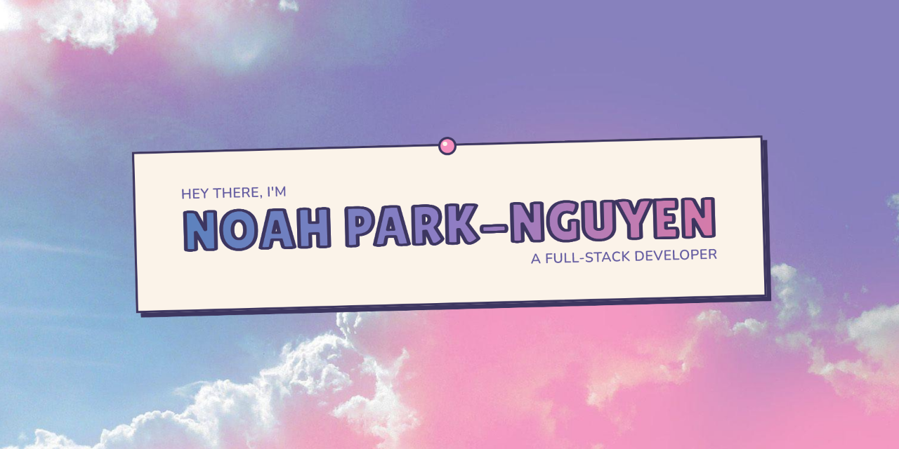

# portfolio

My personal corner of the web — not a résumé, just a cosy little bulletin board
pinned over a pink sky, with live widgets and a few Celeste cameos.

🌐 **Live at [your-domain.com](https://your-domain.com)** _(coming soon)_

## Why I made it

I wanted a space to show off more than just my work — my hobbies, my interests,
the stuff that actually makes me _me_. Most portfolios read like a résumé; this
one's the opposite. It's personal-first, and made mostly for fun.

## Design inspiration

It's built in the spirit of the [indie web](https://indieweb.org) and
[Neocities](https://neocities.org) — that old, handmade, personal web from before
every site started looking the same. The whole thing is a paper bulletin board:
pins, tape, stamps, and a pastel sky. If you want the nitty-gritty of the visual
system, it all lives in [STYLE_GUIDE.md](STYLE_GUIDE.md).

Built with React 19, Vite, and Tailwind v4, running on Cloudflare Workers.

## Thanks for stopping by

That's it — no install instructions, this is my house, not a template. 🌸

MIT licensed ([LICENSE](LICENSE)) — the code's free to reuse, but the photos,
GIFs, and personal bits are mine.
