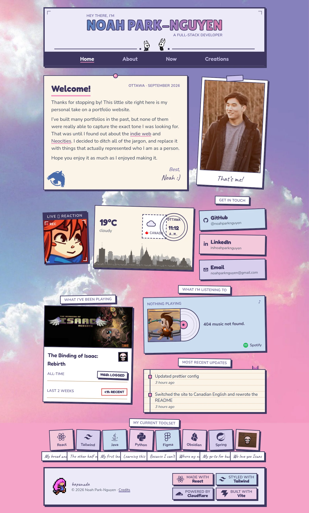

# 🍁 my personal portfolio website

🌐 **Check it out at [noahpn.dev](https://noahpn.dev)**

## What's up? 👋

Thanks for stopping by! This little site right here is my personal take on a
portfolio website. I've built many portfolios in the past, but none of them were
really able to capture the exact tone I was looking for. I decided to ditch all
of the jargon typically aimed at recruiters, and replace it with things that
actually represented who I am as a person. My experience, projects and skills
are all still here, they've just taken a back seat to my non-tech hobbies and
interests. I hope you like it!

## Inspirations

I took a lot of inspiration from the [indie web](https://indieweb.org) and
[Neocities](https://neocities.org), that old handmade personal web from back
before every site started looking the same. The Now page is borrowed from
[Derek Sivers' /now movement](https://nownownow.com), and the portfolio roasting
videos that got me started in the first place are
[Anthony Sistilli's](https://www.youtube.com/playlist?list=PLQg6GaokU5CwD4sIzFuSJlJLJUqXXo1MK). For full
credits, have a look at the site's Colophon, which is the Credits link in the
footer.

Thanks!

— Noah :)

---

MIT licensed ([LICENSE](LICENSE)), so the code's free to reuse, but the
photos, GIFs, and personal bits are mine. Everything the site borrows is
credited on the [Colophon](https://noahpn.dev/credits), and the full third-party
notices, including the ones that are licence obligations rather than
courtesies, are in [`licenses/NOTICE.md`](licenses/NOTICE.md).
