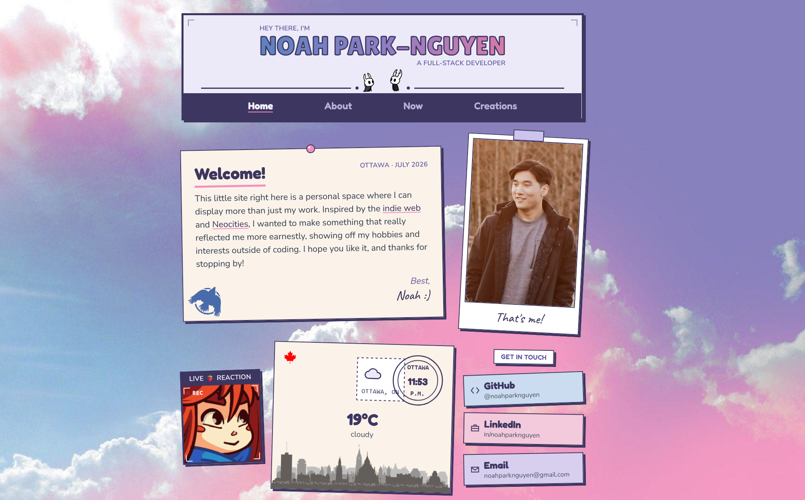
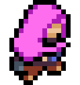

# 🍁 my personal portfolio website

🌐 **Check it out at [noahpn.dev](https://noahpn.dev)**

## What's up? 👋

Thanks for stopping by! This little site right here is my take on a developer
portfolio. I wanted to make something that truly showcased me as a person.
Rather than focus on recruiters and making the site "career-oriented," I wanted
something that could represent both sides of me — my work experience, projects,
and skills, but also my personality, hobbies, and interests. I hope you like it!

## Inspirations

I took a ton of inspiration from the [indie web](https://indieweb.org) and
[Neocities](https://neocities.org) — that old, handmade, personal web from back
before every site started looking the same. The Now page is borrowed from
[Derek Sivers' /now movement](https://nownownow.com). For full credits, check
out the site's Colophon in the footer.

Thanks!

— Noah :)

---

MIT licensed ([LICENSE](LICENSE)) — the code's free to reuse, but the
photos, GIFs, and personal bits are mine.
